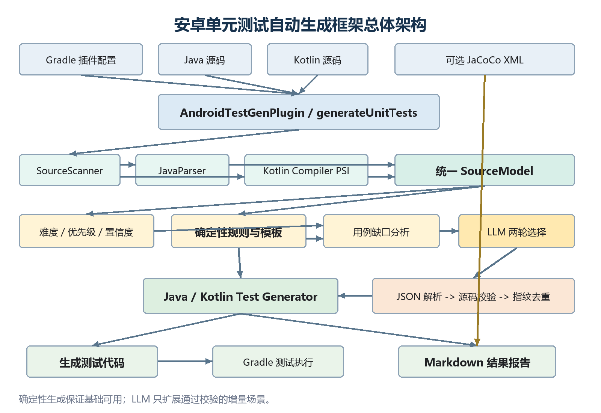

**小学期专业方向课程设计**

**安卓应用单元测试自动生成框架**

**设计与实现**

指导教师：\_\_\_\_\_胡燕\_\_\_\_\_\_\_\_\_\_\_\_\_\_\_\_\_\_\_\_\_\_\_

小组成员：\_施澄宇\_李美霖\_程诗哲\_董羽佳\_\_

完成日期：\_\_\_2023/7/17\_\_\_\_\_\_\_\_\_\_\_\_\_\_\_\_\_\_\_

# 摘要

本项目面向 Android 应用源码，设计并实现了一个基于 Gradle 插件的单元测试自动生成框架。框架以 JavaParser 和 Kotlin Compiler PSI 为源码分析基础，将 Java、Kotlin 类统一转换为内部源码模型，再根据方法结构、依赖关系、Android 组件类型和数据层特征生成 JUnit4、Mockito、MockK、Coroutine Test、Robolectric 与 MockWebServer 测试代码。框架同时提供 Markdown 结果报告、质量分、质量门、JaCoCo XML 读取和测试生成难度分析。

在确定性规则生成器之外，项目接入 Ollama。大语言模型不直接替代已有生成器，而是从经过静态分析和能力校验的候选用例中进行两轮增量选择。模型输出经过结构化 JSON 解析、源码一致性检查、生成能力检查和跨轮指纹去重后，才会转化为可执行测试方法。模型不可用或输出无效时，规则生成结果仍然保留。

当前 Android 示例模块可生成 10 个测试类、26 个测试方法和 46 个断言，质量分为 92/100；插件回归测试 55 项全部通过，Android 示例生成测试 26 项全部通过。项目还完成了 DeepSeek、Qwen、Granite Code 和 Phi-3 四种本地模型的对照生成实验，并在真实天气 Android 项目中完成过阶段性接入验证。

关键词： Android；单元测试生成；Gradle 插件；Kotlin PSI；Mockito；MockK；Ollama；大语言模型

# 1. 项目背景与目标

Android 项目通常同时包含 Java、Kotlin、Android Framework、协程、网络接口、数据库访问和状态管理代码。手工编写单元测试需要开发者识别输入边界、构造依赖、异步行为和可观察结果，工作重复且容易遗漏。本项目尝试把其中可规则化的部分自动完成，并用大语言模型补充候选场景选择能力。

项目目标包括：

1. 以 Gradle 插件形式接入 Android 项目，不要求建立独立桌面程序。

2. 扫描目标模块中的 Java、Kotlin 源码并建立统一源码模型。

3. 根据源码结构生成可以继续编辑和运行的单元测试代码。

4. 支持常见 Android 业务层、状态层、组件层和数据层场景。

5. 使用结构化、可校验的方式让 LLM 参与测试场景生成。

6. 输出生成数量、质量、风险、难度和 LLM 采纳情况报告。

7. 保证 LLM 不可用时仍可使用确定性规则生成。

项目不以自动修改业务源码、自动修复编译错误、无限自治 Agent、企业级多租户和发布到 Gradle Plugin Portal 为目标。

# 2. 技术调研与技术选型

| **技术** | **项目用途** | **选择原因** |
| --- | --- | --- |
| **Gradle Plugin API** | **注册生成与验证任务** | **能直接接入 Android 构建流程，并复用项目依赖和目录结构** |
| **JavaParser** | **Java 抽象语法树解析** | **API 稳定，适合提取类、方法、表达式和依赖调用** |
| **Kotlin Compiler PSI** | **Kotlin 语法结构解析** | **比正则表达式更适合处理 suspend、data class、泛型和 Kotlin 语法** |
| **JUnit4** | **基础测试框架** | **Android 本地单元测试中使用广泛** |
| **Mockito / MockK** | **Java/Kotlin 依赖隔离** | **分别适合 Java 依赖和 Kotlin、协程依赖** |
| **kotlinx-coroutines-test** | **suspend 与协程测试** | **提供 runTest 等可控协程测试工具** |
| **Robolectric** | **Activity/Fragment 本地测试** | **可在 JVM 环境模拟部分 Android Framework 行为** |
| **MockWebServer** | **Retrofit 请求测试** | **不连接真实服务器即可验证请求路径和参数** |
| **JaCoCo XML** | **覆盖率输入** | **使用标准 XML 结果，避免绑定单一 Android 插件版本** |
| **Ollama** | **本地 LLM 推理** | **免费、本地运行** |
| **kotlinx.serialization** | **LLM JSON 解析** | **使用结构化解析和类型校验代替字符串拼接** |

UIAutomator2 更适合设备级 UI 自动化和端到端测试，而本项目核心目标是源码驱动的本地单元测试生成，因此未将其作为主生成链路。Compose UI 和设备测试能力保留为模板或后续扩展方向。

# 3. 总体架构设计

## 3.1 新版总体架构图



图 1  安卓单元测试自动生成框架总体架构

## 3.2 架构原则

1. 确定性生成优先。 基础场景由规则生成器负责，不依赖模型是否在线。

2. LLM 只做受约束增量。 模型只能从预先校验的候选方法、参数和输入策略中选择。

3. 解析、生成、报告分层。 源码解析器不直接拼接测试代码，生成器也不负责计算报告指标。

4. 结果必须可验证。 生成数量、断言数量、采纳原因、跳过原因和风险均进入报告。

5. 真实项目低侵入接入。 插件写入测试目录和报告目录，不修改业务源码。

# 项目结构

```
AndroidUnitTestGenerator/
├── build.gradle.kts                 # 根项目公共配置
├── settings.gradle.kts              # includeBuild 插件和示例模块
├── gradlew / gradlew.bat             # Gradle Wrapper
├── README.md                         # 快速使用和队友开发说明
├── ROADMAP.md                        # 能力状态与收尾任务 docs/
│   ├── stage-1.md ... stage-6.md     # 六个阶段总结
│   ├── project-overview.md           # 项目本质、演示和接入说明
│   └── final-report.md               # 本报告
├── testgen-plugin/
│   ├── build.gradle.kts              # Gradle 插件及解析依赖
│   └── src/
│       ├── main/kotlin/.../testgen/
│       │   ├── AndroidTestGenPlugin.kt
│       │   ├── TestGenExtension.kt
│       │   ├── scanner/              # 源文件扫描
│       │   ├── parser/               # JavaParser 与 Kotlin PSI
│       │   ├── model/                # 统一源码模型和生成结果
│       │   ├── generator/            # Java/Kotlin 测试生成器
│       │   ├── llm/                  # Provider、Prompt、JSON、采纳逻辑
│       │   ├── guide/                # 缺口分析与两轮用例扩展
│       │   ├── analysis/             # 难度、优先级和置信度分析
│       │   ├── report/               # Markdown、覆盖率和验证读取
│       │   └── task/                 # generate/verify Gradle 任务
│       └── test/kotlin/...           # 插件回归测试
├── sample-target/                    # 普通 Java 规则生成示例
└── sample-android-app/               # Android、Kotlin、数据层和 LLM 示例
```

# 5. 分阶段设计与实现

## 5.1 第一阶段：最小可用生成闭环

第一阶段建立 Gradle 插件入口、源码扫描、Java 类解析、测试文件输出和基础 Markdown 报告。目标是确认插件能够在目标模块中读取源码并把生成结果写入 src/test。

本阶段的主要问题是插件项目和被测项目需要在同一仓库中独立构建。项目使用 pluginManagement.includeBuild("testgen-plugin") 让根项目能够直接应用本地插件，并使用 Gradle Wrapper 统一运行方式，避免依赖系统全局 gradle 命令。

## 5.2 第二阶段：规则化断言与边界场景

在基础测试骨架上增加简单算术结果、布尔比较、返回值断言、参数变体和异常场景。生成器根据方法参数与返回类型选择样例值，并统计规则命中数、断言数和回退方法数。

本阶段解决的问题是“生成测试类但没有有效断言”。框架不再只生成可编译的方法外壳，而是尽量产生可观察结果；无法确定语义时使用保守回退，并在报告中单独计数。

## 5.3 第三阶段：依赖识别与 Mock 测试

框架识别构造函数中的 Repository、Service、DAO、API 等依赖，并生成 Mockito 或 MockK 对象、Stub 和 Verify。对于 Kotlin suspend 方法，使用 coEvery、coVerify 和 runTest。

本阶段的核心问题是业务方法往往不能直接实例化运行。解决方案不是连接真实服务，而是从源码模型中提取依赖名和依赖调用，用 Mock 隔离外部行为，使测试关注当前类的业务逻辑。

## 5.4 第四阶段：完整 Android 模块与 Kotlin 支持

项目新增 sample-android-app Android Library 模块，并逐步支持：

- Kotlin data class、普通类和 suspend Repository；

- ViewModel、LiveData 和 StateFlow；

- Context、Resources、SharedPreferences 和 Intent；

- Activity、Fragment 生命周期与 Robolectric；

- Compose UI、Room DAO 和 Retrofit API 的条件模板。

轻量 Kotlin 解析器难以可靠处理泛型、表达式体、注解和协程语法，因此后续改为 Kotlin Compiler PSI。Android 类型也不能统一按普通 JVM 类处理，生成器根据类类型选择纯 JUnit、Mock、Coroutine Test 或 Robolectric 策略。

## 5.5 第五阶段：报告、质量门与覆盖率读取

报告增加生成类、方法、断言、Mock、Robolectric、数据层模板、跳过类、回退方法和风险提示。verifyGeneratedUnitTests 根据最低质量分、跳过类和回退策略验证当前报告。

质量分用于衡量生成过程完整度，不等同于代码覆盖率。当前公式由生成比例、断言密度、专项模板、覆盖率输入、回退惩罚和跳过惩罚组成。JaCoCo 部分只读取目标项目已经生成的 XML；如果目标项目没有应用 JaCoCo 并运行对应任务，报告会明确显示 No JaCoCo XML report was available，而不会伪造覆盖率。

## 5.6 第六阶段：数据层深度模板

本阶段增强 Repository Result<T>、Retrofit 接口、Retrofit 注解、MockWebServer 和 Room DAO 模板。网络测试使用 MockWebServer 或 Mock 接口，不连接真实服务；数据库模板使用测试数据库或 DAO 契约，不连接生产数据库。

数据层模板采取保守生成策略：只有在源码结构和依赖特征足够明确时才生成专项断言，否则保留基础测试并在报告中提示人工检查。这一设计避免为了提高数量生成语义错误的测试。

## 5.7 LLM 结构化测试规划

项目在第六阶段后接入 LLM。最初模型只输出自然语言建议，无法证明其参与了测试代码生成；后续增加结构化 JSON Schema、Prompt Builder、响应解析器和场景采纳器，使建议能够转换为实际测试方法。

模型输出必须满足以下条件：

1. 目标类和方法真实存在；

2. 目标参数属于该方法；

3. 输入策略与参数类型兼容；

4. 场景属于生成器当前能够实现的范围；

5. 没有与已采纳场景重复。

不满足条件的场景会被拒绝并记录原因。模型没有返回有效 JSON 时，确定性测试仍然生成。

## 5.8 两轮用例指引迭代扩展

两轮扩展不是重新扫描“上一轮未测试的类”，而是在同一批源码目标中继续寻找尚未生成的参数场景。例如 Repository 的 city 参数已经有普通有效值测试，但仍可能缺少空字符串和空白字符串场景。

具体流程为：

1. 缺口分析器枚举生成器能够实现的候选场景；

2. 按测试优先级、自动化置信度和难度形成 guideValue；

3. LLM 第一轮选择高价值场景；

4. 采纳器校验并生成 guide\_i1\_ 测试；

5. 使用“类、方法、参数、策略”指纹排除已采纳场景；

6. 第二轮从剩余候选中选择并生成 guide\_i2\_ 测试；

7. 报告记录每轮候选数、采纳数、重复数、拒绝数和剩余缺口。

## 5.9 测试生成难度

TestabilityAnalyzer 对每个可生成目标计算：

- Difficulty：控制流、依赖、异步状态、Android 耦合、外部资源和生成器限制的总和；

- Priority：测试价值和风险优先级；

- Confidence：当前生成器自动生成有效测试的把握；

- Recommended strategy：JUnit、Mockito/MockK、Coroutine、Robolectric、Retrofit 等建议；

- Boundary focus：值得补充的参数边界或失败路径。

这些分数来自确定性静态规则，不由 LLM 打分。LLM 只参考分析结果进行候选场景选择。

# 6. 关键代码实现

## 6.1 Gradle 插件入口

插件注册生成任务和验证任务，并把扩展配置映射到任务属性：

```
val generateTask = project.tasks.register(
    "generateUnitTests",
    GenerateUnitTestsTask::class.java,
) { task ->
    task.sourceDir.set(extension.sourceDir)
    task.testOutputDir.set(extension.testOutputDir)
    task.reportOutputDir.set(extension.reportOutputDir)
    task.enableLlm.set(extension.enableLlm)
    task.llmProvider.set(extension.llmProvider)
    task.llmModel.set(extension.llmModel)
    task.guideExpansionIterations.set(extension.guideExpansionIterations)
}

project.tasks.register(
    "verifyGeneratedUnitTests",
    VerifyGeneratedUnitTestsTask::class.java,
) { task ->
    task.dependsOn(generateTask)
    task.reportFile.set(extension.reportOutputDir.file("report.md"))
    task.minimumQualityScore.set(extension.minimumQualityScore)
}
```

代码位置：AndroidTestGenPlugin.kt。

## 6.2 生成任务主流水线

生成任务根据文件扩展名选择解析器，先计算测试难度，再执行可选的 LLM 两轮扩展，最后按语言调用生成器：

```
val parsedClasses = sourceFiles.flatMap { sourceFile ->
    when (sourceFile.extension) {
        "java" -> javaParser.parse(sourceFile)
        "kt" -> kotlinParser.parse(sourceFile)
        else -> emptyList()
    }
}

val testabilityInsights = TestabilityAnalyzer().analyze(parsedClasses)

val guideExpansion = if (llmConfig.enabled) {
    IterativeTestSuiteExpander(
        guideGenerator = LlmTestCaseGuideGenerator(
            client = LlmClientFactory.create(llmConfig),
        ),
    ).expand(
        classes = parsedClasses,
        maxIterations = guideExpansionIterations.get(),
        insights = testabilityInsights,
    )
} else null

val generatedSource = when (classModel.language) {
    SourceLanguage.JAVA -> javaGenerator.generate(classModel, guidance)
    SourceLanguage.KOTLIN -> kotlinGenerator.generate(classModel, guidance)
}
```

代码位置：GenerateUnitTestsTask.kt。

## 6.3 可解释难度评分

难度分由多个证据项相加，并限制在 0 到 100：

```
val evidence = buildList {
    controlFlowEvidence(method)?.let(::add)
    dependencyEvidence(dependencyNames, method)?.let(::add)
    asyncEvidence(model, method)?.let(::add)
    androidFrameworkEvidence(model, method)?.let(::add)
    externalResourceEvidence(model, method)?.let(::add)
    generatorLimitationEvidence(model, method)?.let(::add)
}
val difficulty = evidence.sumOf { it.points }.coerceIn(0, 100)
```

例如依赖复杂度按“依赖数量 × 7 + 依赖调用数量 × 2”计算，最高 20 分；控制流按条件、异常路径和额外返回点计算，最高 25 分。证据项同时保存文字说明，供报告展示。

代码位置：TestabilityAnalyzer.kt。

## 6.4 LLM Prompt 约束

Prompt 不允许模型自由创造方法，而是要求它从预校验候选中精确选择：

```
Select exactly ${maxGuides.coerceAtMost(candidates.size)} high-value guide
from the supplied uncovered choices.
Use methodName, targetParameter, and inputStrategy exactly as supplied.
Do not reuse an accepted guide and do not invent methods, parameters,
strategies, dependencies, or behavior.
Return JSON only.
```

候选信息包含方法、参数、输入策略、优先级、难度、置信度和 guideValue。代码位置：LlmPromptBuilder.kt。

## 6.5 两轮采纳与去重

只有状态为 GENERATED 且通过采纳器校验的场景才能进入生成器；指纹重复时改记为 DUPLICATE：

```
if (decision.status == LlmAdoptionStatus.GENERATED && acceptedScenario != null) {
    val guide = TestCaseGuide(iteration, sourceClass, acceptedScenario)
    if (!acceptedFingerprints.add(guide.fingerprint)) {
        duplicateCount++
    } else {
        acceptedCount++
        acceptedByClass.getOrPut(sourceClass) { mutableListOf() } += acceptedScenario
    }
}
```

代码位置：IterativeTestSuiteExpander.kt。

## 6.6 实际生成的 Kotlin 测试

以下测试来自当前 KotlinWeatherRepositoryGeneratedTest.kt，其中两个方法分别由两轮 LLM 用例指引产生：

```
private val api = mockk<KotlinWeatherApi>()
private val target = KotlinWeatherRepository(api)

@Test
fun loadForecast_llm_guide_i1_loadForecast_city_blank_string() = runTest {
    coEvery { api.fetchForecast(any()) } returns KotlinForecastResponse()

    val result = target.loadForecast(" ")

    assertNotNull(result)
    coVerify { api.fetchForecast(any()) }
}

@Test
fun loadForecast_llm_guide_i2_loadForecast_city_empty_string() = runTest {
    coEvery { api.fetchForecast(any()) } returns KotlinForecastResponse()

    val result = target.loadForecast("")

    assertNotNull(result)
    coVerify { api.fetchForecast(any()) }
}
```

方法名中的 i1 和 i2 可用于报告、源码和演示截图之间的对应验证。

# 7. 生成单元测试效果报告

## 7.1 评估方法

项目从以下维度评估生成效果：

| **维度** | **指标** | **说明** |
| --- | --- | --- |
| **生成完整性** | **解析类、生成类、跳过类** | **判断目标源码是否得到处理** |
| **测试规模** | **方法数、断言数** | **判断输出是否只有空骨架** |
| **专项能力** | **Mock、协程、Robolectric、Retrofit 等** | **判断是否匹配 Android 场景** |
| **可执行性** | **Gradle 测试通过数和失败数** | **判断生成代码能否编译运行** |
| **生成质量** | **质量分、回退数、跳过数** | **判断生成过程是否完整且保守** |
| **LLM 贡献** | **建议数、采纳方法数、两轮收益** | **判断模型是否实际进入代码生成** |
| **可测试性** | **难度、优先级、置信度** | **判断哪些目标适合自动生成** |

## 7.2 当前基线结果（当前数据采用示例天气预报项目）

| **项目** | **当前结果** |
| --- | --- |
| **解析源码类** | **10** |
| **生成测试类** | **10** |
| **生成测试方法** | **26** |
| **生成断言** | **46** |
| **跳过类** | **0** |
| **LLM 建议** | **8** |
| **LLM 采纳测试方法** | **2** |
| **用例扩展轮数** | **2** |
| **采纳用例指引** | **2** |
| **分析目标** | **21** |
| **平均生成难度** | **18.3** |
| **高优先级目标** | **7** |
| **自动化可用目标** | **20** |
| **质量分** | **92/100** |

当前最难目标为 KotlinWeatherRepository#loadForecast，难度 30/100；最高测试优先级目标为 LoginViewModel#loadDisplayName，优先级 85/100。

## 7.3 测试执行结果

| **验证范围** | **测试数** | **失败** | **结果** |
| --- | --- | --- | --- |
| **插件回归测试** | **55** | **0** | **通过** |
| **Android 示例生成测试** | **26** | **0** | **通过** |
| **Java 示例测试** | **35** | **0** | **通过** |

插件回归测试覆盖解析器、生成器、LLM 客户端工厂、JSON Schema、响应解析、场景采纳、两轮扩展、难度分析、覆盖率读取和报告写入。Android 示例验证生成代码的编译和运行结果。

## 7.4 质量分解释

质量分公式为：

生成类比例                 最高 60 分
每个生成类的断言密度       最高 20 分
Android/数据层专项模板       15 分或 5 分
存在 JaCoCo XML             额外 5 分
每个回退方法                扣 3 分，最多扣 20 分
每个跳过类                  扣 5 分，最多扣 20 分

当前得分 92 分的主要原因是：10 个解析类全部生成、断言密度达到上限、存在 Android/数据层专项模板、没有跳过类；当前没有 JaCoCo XML，并存在 1 个保守回退方法。质量分衡量的是生成过程，不应替代测试覆盖率和人工语义审查。

## 7.5 四模型对照实验

四个模型使用同一份源码、同一套 Prompt、相同 JSON Schema、两轮扩展和相同生成器运行。报告保存在 sample-android-app/build/reports/testgen/model-comparison。

| **模型** | **参数规模** | **本次耗时** | **建议数** | **采纳场景** | **测试方法** | **断言** | **质量分** |
| --- | --- | --- | --- | --- | --- | --- | --- |
| **DeepSeek Coder** | **6.7B** | **28.8 秒** | **8** | **2** | **26** | **46** | **92** |
| **Qwen2.5 Coder** | **3B** | **76.9 秒** | **8** | **1** | **25** | **45** | **92** |
| **Granite Code** | **3B** | **24.0 秒** | **7** | **0** | **24** | **44** | **92** |
| **Phi-3 Mini** | **3.8B** | **14.7 秒** | **8** | **2** | **26** | **46** | **92** |

实验说明：

1. DeepSeek 和 Phi-3 均成功完成两轮扩展，各采纳 2 个场景。

2. Qwen 成功采纳 1 个场景，说明模型能够参与生成，但第二轮结构化选择未形成新的有效场景。

3. Granite 返回了建议，但没有场景通过采纳，框架仍生成 24 个确定性测试方法，证明回退机制有效。

4. 四个模型质量分相同，因为质量分主要评价确定性生成完整性，不是专门评价 LLM 推理质量；LLM 差异更适合用采纳数和新增方法数表示。

5. 耗时受模型加载、缓存、机器负载和运行顺序影响，只作为本机实验记录，不代表通用性能排名。

6. 当前已保存四次生成报告；DeepSeek 与当前 Phi-3 输出存在完整测试通过记录。正式宣称四模型全部可执行前，应分别执行一次 testDebugUnitTest 并保存测试结果。

## 7.6 真实项目阶段性验证

阶段性记录为：

| **指标** | **结果** |
| --- | --- |
| **生成测试类** | **12** |
| **生成测试方法** | **17** |
| **生成断言** | **49** |
| **质量分** | **82/100** |

接入过程只调整 Gradle 插件配置和测试依赖，不修改天气业务源码。该实验说明框架不是只能处理内置示例，但真实项目结果仍需要在最终环境中重新回归，才能作为最终验收数据。

# 8. 关键问题

## 8.1 Java 与 Kotlin 双语言解析

JavaParser 和 Kotlin PSI 输出的数据结构不同，而生成器需要统一处理类名、方法、参数、依赖、注解和表达式。项目通过 SourceModel 建立中间表示，使上层难度分析、缺口分析和报告逻辑不直接依赖某一种 AST。当前 Kotlin PSI 已明显强于早期轻量解析，但复杂 Kotlin 语义、扩展函数和编译期类型推断仍有提升空间。

## 8.2 Android 本地单元测试与设备测试边界

Activity、Fragment、Context 和资源访问不能全部按照普通 JVM 类执行。项目分别使用纯 JUnit、Mock、Coroutine Test 和 Robolectric，Compose UI 与设备级交互则保守处理。UIAutomator2、Espresso 和完整设备测试不属于当前本地单元测试主链路，避免项目范围失控。

## 8.3 LLM 输出稳定性与可控生成

小模型可能返回自然语言、错误字段、重复场景或不存在的方法。项目没有直接执行模型生成的任意代码，而是采用“候选约束、JSON Schema、源码校验、能力校验、指纹去重、规则回退”的组合。四模型实验中 Granite 的 0 采纳结果说明该校验不是形式上的；无效输出确实会被拒绝。

## 8.4 质量分与覆盖率不能混用

质量分来自生成统计，JaCoCo 来自测试执行后的字节码覆盖率，两者用途不同。当前框架已能读取 JaCoCo XML，但示例模块当前没有对应 XML，因此报告只能标记覆盖率输入缺失。最终报告必须保持这一事实，不能把 92/100 写成 92% 代码覆盖率。

## 8.5 插件可移植性与本地模型边界

模型文件不会提交到 GitHub。插件通过 Gradle 属性或环境变量读取 Provider、模型和端点，队友可以使用本机 Ollama，也可以关闭 LLM 使用规则生成。PowerShell 中带小数点的 -Ptestgen.llm.\* 参数需要整体加引号，批量实验使用参数数组以避免命令被拆分。

# 9. 使用与演示流程

## 9.1 确定性生成演示

```
.\gradlew.bat :sample-target:generateUnitTests --rerun-tasks
.\gradlew.bat :sample-target:test --rerun-tasks
```

## 9.2 Android 与 LLM 生成演示

```
$gradleArgs = @(
    ":sample-android-app:generateUnitTests"
    "--rerun-tasks"
    "-Ptestgen.llm.enabled=true"
    "-Ptestgen.llm.provider=ollama"
    "-Ptestgen.llm.model=deepseek-coder:6.7b-instruct"
    "-Ptestgen.llm.endpoint=http://localhost:11434/api/generate"
)

.\gradlew.bat $gradleArgs
.\gradlew.bat :sample-android-app:testDebugUnitTest --rerun-tasks
.\gradlew.bat :sample-android-app:verifyGeneratedUnitTests `
    -x :sample-android-app:generateUnitTests
```

建议依次展示：终端中的模型配置、生成数量、guide\_i1\_ 和 guide\_i2\_ 方法、测试全部通过、Markdown 报告摘要、两轮扩展表、测试难度排行和四模型对比结果。

# 10. 当前限制与后续工作

1. 为 JaCoCo 配置稳定的示例任务并保存实际 XML，完成覆盖率展示闭环。

2. 在报告中进一步展开每个难度维度的代码证据和计算式。

3. 别对四个模型执行“生成、编译、测试、保存报告”的完整回归。

4. 增加 LLM 响应缓存，减少重复实验等待时间。

5. 续扩展枚举、集合、代表性有效值和常见异常场景。

6. 使用更多真实 ViewModel、Compose、Room 和 Retrofit 项目验证模板。

7. 处理 Kotlin Compiler Embeddable 与 Kotlin Gradle Plugin 同时进入构建类路径的警告。

8. 优化 Gradle JVM 和 Metaspace 参数，减少首次构建后的重复开销。

9. 当前单次任务内已经跨轮去重，后续可增加跨次生成历史去重。这些工作属于提高兼容性和工程成熟度的后续方向。

# 11. 结论

本项目完成了从源码扫描、Java/Kotlin 解析、规则化场景生成、Android 专项模板、依赖 Mock、协程和数据层测试，到报告、质量门、难度分析和 LLM 两轮用例扩展的完整链路。项目没有把 LLM 作为不可验证的代码生成黑盒，而是将其限制在候选测试场景选择环节，并通过结构化解析、源码校验、生成能力校验和回退机制保证稳定性。当前验证结果表明，框架可以在示例 Android 模块中稳定生成并运行测试，也能够区分不同本地模型的有效采纳能力。
