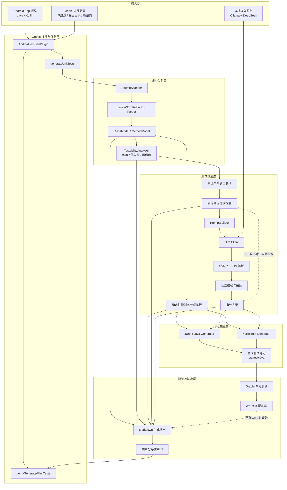

# 项目本质说明

## 项目定位

AndroidUnitTestGenerator 是一个基于 Gradle 插件的 Android 单元测试自动生成框架。项目目标是在 Android 工程构建阶段扫描 Java/Kotlin 源码，解析代码结构，按规则生成可编译、可运行的本地单元测试，并输出生成质量报告。

该项目不是运行时测试工具，也不是人工编写测试的替代品。它的本质是：

```text
源码分析工具 + 测试模板生成器 + 生成质量报告器
```

## 基于 Gradle 插件的含义

Android 项目通常使用 Gradle 管理构建、测试和依赖。将本框架实现为 Gradle 插件，可以使测试生成能力直接接入 Android Studio 工程。

目标模块应用插件后：

```kotlin
plugins {
    id("io.github.dreamofloser.android-testgen")
}
```

插件会注册两个主要任务：

| 任务 | 作用 |
| --- | --- |
| `generateUnitTests` | 扫描源码、解析结构、生成测试代码、输出报告 |
| `verifyGeneratedUnitTests` | 读取生成报告，检查生成数量、断言数量和质量分是否达标 |

插件入口位于：

```text
testgen-plugin/src/main/kotlin/io/github/dreamofloser/testgen/AndroidTestGenPlugin.kt
```

生成任务位于：

```text
testgen-plugin/src/main/kotlin/io/github/dreamofloser/testgen/task/GenerateUnitTestsTask.kt
```

## 总体架构设计

系统采用分层流水线架构。Gradle 插件负责接入目标 Android 工程和编排任务；AST/PSI 解析器把 Java/Kotlin 源码转换为统一模型；规则模板、用例指引迭代器与 LLM Agent 共同形成测试场景；代码生成器输出测试源码；Gradle、JaCoCo 和报告模块负责验证生成效果。LLM 只从已校验的缺口候选中选择增量场景，不直接修改业务源码。



从职责上看，框架可归纳为七个部分：

| 层级 | 核心职责 | 主要实现位置 |
| --- | --- | --- |
| 接入层 | 应用插件、注册生成和验证任务、读取配置 | `AndroidTestGenPlugin.kt`、`TestGenExtension.kt` |
| 分析层 | 扫描源码并建立统一的类、方法、参数模型 | `scanner/`、`parser/`、`model/` |
| 洞察层 | 计算测试难度、优先级、自动化置信度、策略和价值矩阵 | `analysis/` |
| 规则规划层 | 按源码类型选择普通类、ViewModel、生命周期、Room、Retrofit 等模板 | `generator/TestScenarioGenerator.kt` |
| LLM 规划层 | 分析用例缺口、控制两轮扩展、构造 Prompt、解析 JSON、校验并去重 | `guide/`、`llm/` |
| 生成层 | 将规则场景和已采纳 LLM 场景转换为 Java/Kotlin 测试代码 | `generator/JUnit4JavaTestGenerator.kt`、`generator/KotlinUnitTestGenerator.kt` |
| 验证层 | 执行测试、读取覆盖率、生成报告并检查质量门 | `report/`、`VerifyGeneratedUnitTestsTask.kt` |

## 自动生成测试代码的实现方式

自动生成过程采用确定性的规则和模板，不依赖人工临时编写。

整体流程如下：

```text
源码目录
  -> SourceScanner 扫描 .java / .kt 文件
  -> JavaSourceParser / KotlinSourceParser 解析源码
  -> ClassModel / MethodModel 表示类、方法、参数、注解、依赖调用
  -> JUnit4JavaTestGenerator / KotlinUnitTestGenerator 选择模板
  -> 写入 src/test/java 或配置的测试输出目录
  -> MarkdownReportWriter 输出生成报告
```

核心模型位于：

```text
testgen-plugin/src/main/kotlin/io/github/dreamofloser/testgen/model/SourceModel.kt
```

生成器位于：

```text
testgen-plugin/src/main/kotlin/io/github/dreamofloser/testgen/generator/JUnit4JavaTestGenerator.kt
testgen-plugin/src/main/kotlin/io/github/dreamofloser/testgen/generator/KotlinUnitTestGenerator.kt
```

生成器会根据源码类型选择模板，例如：

| 源码类型 | 生成模板 |
| --- | --- |
| 普通 Java/Kotlin 类 | JUnit4 基础测试、参数样例、基础断言 |
| 构造函数依赖类 | Mockito / MockK stub 与 verify |
| ViewModel | LiveData / StateFlow / Coroutine 测试 |
| Activity / Fragment | Robolectric 生命周期测试 |
| Compose UI | Compose test rule 与 testTag 断言 |
| Retrofit API | MockK 契约、注解检查、MockWebServer 请求与错误响应测试 |
| Room DAO | MockK DAO 契约测试 |

## 测试难度与 Insights

`TestabilityAnalyzer` 在代码生成前读取 `ClassModel` 和 `MethodModel`。它与生成质量分用途不同：

| 指标 | 评价对象 | 主要用途 |
| --- | --- | --- |
| Generation difficulty | 被测源码 | 判断自动生成测试有多难 |
| Test priority | 被测源码 | 判断哪些方法更值得优先测试 |
| Automation confidence | 生成器能力与源码匹配程度 | 判断自动生成结果需要多少人工复核 |
| Generation quality score | 已生成结果 | 判断本次生成数量、断言和模板命中是否充分 |

难度满分为 100，分值来自以下可追溯证据：

| 难度来源 | 最高分 | 示例证据 |
| --- | ---: | --- |
| Control flow | 25 | 条件、异常路径和多个返回 |
| Dependencies | 20 | 构造注入依赖和真实依赖调用 |
| Async and state | 15 | `suspend`、Flow、LiveData、StateFlow |
| Android framework | 15 | Activity、Fragment、Compose、Context |
| External resources | 15 | Retrofit、Room、Repository、数据库和存储 |
| Generator limitations | 10 | 重载、复杂参数、缺少可观察结果 |

核心实现：

```text
testgen-plugin/src/main/kotlin/io/github/dreamofloser/testgen/analysis/
|-- TestabilityInsight.kt
`-- TestabilityAnalyzer.kt
```

报告中的主要洞察包括：

- `Key Findings`：最难目标、最高优先级目标和主要难度来源。
- `Test Value Matrix`：优先自动化、引导生成、批量生成、延后复核四个象限。
- `Method Ranking`：逐方法显示难度、优先级、置信度、策略、证据和边界关注点。
- `Difficulty Driver Distribution`：统计整个项目的主要可测试性阻力。
- `Iteration Gain Insight`：显示规则基线以及每轮 LLM 新增测试数。

两轮指引候选还会计算 `guideValue`：

```text
guideValue =
    50% test priority
  + 30% automation confidence
  + 20% ease of generation
```

候选按该值排序后交给 LLM，使模型优先选择有测试价值、同时能够可靠生成代码的场景。分数由确定性规则计算，LLM 不直接决定评分。

## 质量分的来源

质量分是生成结果的启发式评分，不等同于业务覆盖率。它用于衡量“本次自动生成结果是否充分、是否需要人工重点复核”。

质量分计算位于：

```text
testgen-plugin/src/main/kotlin/io/github/dreamofloser/testgen/report/MarkdownReportWriter.kt
```

主要因素包括：

| 因素 | 影响 |
| --- | --- |
| 解析类数量与生成类数量比例 | 生成比例越高，得分越高 |
| 生成断言数量 | 断言越充分，得分越高 |
| 专项模板命中 | Android、Compose、Room、Retrofit、Robolectric 等模板会提高评分 |
| JaCoCo 覆盖率输入 | 如果报告读取到 JaCoCo XML，会获得额外加分 |
| fallback 模板数量 | fallback 越多，扣分越多 |
| skipped class 数量 | 跳过类越多，扣分越多 |

`verifyGeneratedUnitTests` 会读取报告并检查质量分是否低于配置阈值。示例模块当前配置：

```kotlin
minimumQualityScore.set(80)
```

## JaCoCo 覆盖率说明

当前框架已经支持读取已有 JaCoCo XML 并写入生成报告，但尚未在所有 Android 项目中自动创建和执行 JaCoCo 任务。

原因包括：

- 普通 JVM 模块通常使用 `test` 任务。
- Android 模块通常使用 `testDebugUnitTest`、`testReleaseUnitTest` 等 variant 任务。
- 多 flavor 项目可能存在 `testFreeDebugUnitTest`、`testPaidDebugUnitTest` 等任务。
- 多模块项目可能生成多个 JaCoCo XML，需要合并。
- Android Gradle Plugin 不同版本对 coverage 任务和输出路径存在差异。

因此当前采用稳定策略：

```text
如果项目已有 JaCoCo XML，生成器读取并写入报告；如果没有，则报告标记 Coverage input 为 REVIEW，但不阻塞测试生成。
```

该设计避免覆盖率任务配置失败影响测试代码生成。后续扩展方向是自动识别 Android variant、定位 JaCoCo XML、支持多模块覆盖率合并。

## 验证体系

项目采用四层验证：

| 层级 | 作用 |
| --- | --- |
| `testgen-plugin` 单元测试 | 验证解析器、生成器、报告读取器 |
| `sample-target` | 验证普通 Java/Kotlin 模块和 JaCoCo 读取 |
| `sample-android-app` | 验证 Android、Kotlin、Robolectric、MockK、MockWebServer 模板 |
| 真实 weather 项目 | 验证插件能否接入真实 Android Studio 工程 |

真实项目只作为落地验证样本，不应为了适配生成器修改业务源码。允许修改的是 Gradle 插件接入、测试依赖、生成目录和包名过滤配置。

## 生成单元测试效果评估

效果评估不能只看生成数量或内部质量分。课程验收采用“自动指标 + 人工抽查”的轻量方案，从可生成性、正确性、有效性、覆盖能力、LLM 增量贡献和效率六个方面评价。

### 评估指标

| 维度 | 指标与计算方式 | 数据来源 |
| --- | --- | --- |
| 可生成性 | 类生成率 = 生成测试类数 /（生成测试类数 + 跳过类数） | `report.md` 的 Summary、Skipped Classes |
| 编译正确性 | 生成测试能否通过目标模块测试任务的编译阶段 | Gradle `test` 或 `testDebugUnitTest` 输出 |
| 执行正确性 | 测试通过率 = 通过测试数 / 执行测试总数 | Gradle HTML Test Report |
| 断言有效性 | 断言密度 = 生成断言数 / 生成测试方法数 | `report.md` 的 Summary |
| 覆盖能力 | 行覆盖率、分支覆盖率；同时记录生成前后增量 | JaCoCo HTML/XML 报告 |
| LLM 贡献 | LLM 新增方法数；场景采纳率 = `GENERATED` 场景数 / 结构化候选场景数 | Structured JSON Plans、Suggestion Adoption |
| 生成效率 | `generateUnitTests` 的实际执行时间 | Gradle 终端 `BUILD SUCCESSFUL in ...` |
| 人工有效性 | 抽查测试是否调用真实目标方法、包含有效断言、边界输入和正确 Mock | 随机抽取 10 个生成方法人工评分 |

生成质量分用于框架内部质量门，不替代测试通过率和覆盖率。

### 对照实验设计

在同一台电脑、同一版本源码和相同 Gradle 配置下执行两组实验，每组完整执行三次，记录中位耗时：

| 实验组 | 配置 | 目的 |
| --- | --- | --- |
| A：纯规则生成 | `TESTGEN_LLM_ENABLED=false` | 作为稳定基线 |
| B：规则 + LLM | `TESTGEN_LLM_ENABLED=true`，Provider 为 `ollama` | 观察 LLM 新增场景、方法和时间开销 |

建议至少选择两个对象：`sample-android-app` 用于稳定复现，真实 weather App 用于证明插件可以处理外部项目。`sample-target` 主要用于展示 JaCoCo 覆盖率读取。

纯规则组执行命令：

```powershell
$env:TESTGEN_LLM_ENABLED = 'false'
.\gradlew.bat :sample-android-app:generateUnitTests --rerun-tasks
.\gradlew.bat :sample-android-app:testDebugUnitTest --rerun-tasks
.\gradlew.bat :sample-android-app:verifyGeneratedUnitTests -x :sample-android-app:generateUnitTests
```

规则与 LLM 混合组执行命令：

```powershell
$env:TESTGEN_LLM_ENABLED = 'true'
$env:TESTGEN_LLM_PROVIDER = 'ollama'
$env:TESTGEN_LLM_MODEL = 'deepseek-coder:6.7b-instruct'
$env:TESTGEN_LLM_ENDPOINT = 'http://localhost:11434/api/generate'
.\gradlew.bat :sample-android-app:generateUnitTests --rerun-tasks
.\gradlew.bat :sample-android-app:testDebugUnitTest --rerun-tasks
.\gradlew.bat :sample-android-app:verifyGeneratedUnitTests -x :sample-android-app:generateUnitTests
```

### 结果记录表

2026 年 7 月 15 日在同一工作区完成单次热缓存对照。正式性能实验可继续执行三次并取中位数；以下结果用于课程验收，不使用 `mock` Provider 证明真实 LLM 效果：

| 项目与实验组 | 生成类 | 生成方法 | 断言 | 跳过类 | 测试通过率 | 行/分支覆盖率 | LLM 新增方法 | 质量分 | 耗时 |
| --- | ---: | ---: | ---: | ---: | ---: | --- | ---: | ---: | --- |
| sample-android-app / 纯规则 | 10 | 24 | 44 | 0 | 24/24，100% | N/A | 0 | 92/100 | 约 7 秒 |
| sample-android-app / 规则 + Ollama 两轮扩展 | 10 | 26 | 46 | 0 | 26/26，100% | N/A | 2 | 92/100 | 1 分 16 秒 |

真实 weather App 的规则生成烟雾测试另行记录为 12 个测试类、17 个测试方法、49 个断言、质量分 82/100，用于证明插件输入可以替换为外部 Android 项目，不与示例模块的 LLM A/B 数据混合计算。

### 人工抽查标准

从普通类、Repository、ViewModel、Activity/Fragment、Retrofit/Room 等已命中的类型中抽取最多 10 个生成方法，每项记 0 或 1 分：

| 检查项 | 合格条件 |
| --- | --- |
| 目标一致 | 测试调用的方法与被测类真实存在且匹配 |
| 场景有效 | 输入代表正常、边界或异常场景，而不是无意义占位值 |
| 断言有效 | 断言检查返回值、状态或交互，不只检查固定常量 |
| Mock 正确 | stub 和 verify 面向真实依赖调用，参数与次数合理 |
| 可维护性 | 测试名称能表达 Given/When/Then 或具体行为 |

人工有效率 = 获得的总分 /（抽查方法数 × 5）。该指标用于补充覆盖率，因为高覆盖率不必然代表断言有业务意义。

### 当前可作为截图的基线结果

| 对象 | 当前结果 | 可证明内容 |
| --- | --- | --- |
| `sample-android-app` | 10 个测试类、26 个测试方法、46 个断言、0 个跳过类、质量分 92/100 | 类生成率 100%，断言密度 1.77 |
| Android Gradle 测试报告 | 26 个测试、0 个失败、成功率 100% | 生成测试可以编译并执行 |
| 真实 Ollama 参与 | Provider 为 `ollama`，模型为 `deepseek-coder:6.7b-instruct`，两轮均为 `EXPANDED`，采纳 2 个场景 | LLM 指引已经转换为两个 `llm_guide_i*` 测试方法 |
| Testability Insights | 分析 21 个目标、平均难度 18.3/100、7 个高优先级目标 | 最难目标为 Weather Repository，最高优先级为 Login ViewModel 状态更新 |
| `sample-target` JaCoCo | 行覆盖率 87.27%、分支覆盖率 83.33%、方法覆盖率 93.75% | 框架可以读取并汇总真实覆盖率 |
| `testgen-plugin` 自身测试 | 55 个测试、0 个失败、成功率 100% | 解析器、生成器、用例指引迭代器、难度分析器和报告模块通过回归测试 |

当前 `sample-android-app` 报告和测试结果均来自真实 Ollama 生成流程。报告中的采纳汇总为 `GENERATED=2`；第 1 轮生成 `loadForecast_llm_guide_i1_loadForecast_city_empty_string`，第 2 轮生成 `loadForecast_llm_guide_i2_loadForecast_city_blank_string`。两个方法均包含在 26/26 通过的 Gradle 测试结果中。建议数量从旧流程的 49 条降为 8 条，是因为新流程只请求确有可生成缺口的类；评价重点是采纳并执行的增量用例，而不是建议总数。

## LLM Agent 当前实现

当前框架采用“确定性生成器为主体，LLM Agent 提供增量规划”的混合架构。LLM 相关实现位于：

```text
testgen-plugin/src/main/kotlin/io/github/dreamofloser/testgen/llm/
```

执行 `generateUnitTests` 时，LLM 参与流程如下：

```text
AST/PSI 解析后的 ClassModel
  -> TestCaseGapAnalyzer 枚举可生成但尚未覆盖的候选
  -> 第 1 轮 Prompt 只发送候选类、方法、参数和输入策略
  -> LLM 输出结构化 JSON 用例指引
  -> LlmScenarioAdopter 检查方法、参数、类型和生成器能力
  -> 记录“源码类 + 方法 + 参数 + 输入策略”指纹
  -> 第 2 轮重新分析并排除第 1 轮已采纳指纹
  -> 可安全映射的两轮场景交给 Java/Kotlin 生成器
  -> 规则场景与 LLM 场景共同生成测试代码
  -> 报告记录每轮候选、采纳、重复、拒绝和剩余缺口
```

LLM 只分析当前存在受支持缺口的类，不会直接无约束输出整份测试源码。这样可以减少无效推理，并避免较小本地模型虚构方法、依赖或返回值。某轮没有可用缺口时会记录 `NO_GAPS`；模型失败或 JSON 无效时会记录对应状态，但规则生成结果仍然保留。

当前 Agent 已具备结构化规划、候选场景筛选、两轮迭代和生成建议采纳。LLM 可以从源码允许的候选项中选择目标参数和输入策略，当前支持空字符串、仅空格字符串、null、零值、负数、false 和空集合，再由确定性生成器转换为可编译测试。项目不使用 LLM 修改业务源码，也不根据编译失败自动修复代码。

## 用例指引生成器

用例指引是 LLM 对“下一条应该补什么测试”的结构化选择，不是由模型自由编写的整份测试源码。指引至少包含源码类、目标方法、目标参数、输入策略、测试类别和测试名称。确定性生成器读取这些字段后，负责产生 import、Mock、协程结构、方法调用和断言。

核心实现位于：

```text
testgen-plugin/src/main/kotlin/io/github/dreamofloser/testgen/guide/
|-- TestCaseGuide.kt                 指引、指纹、候选缺口和轮次结果模型
|-- TestCaseGapAnalyzer.kt           根据源码模型枚举生成器支持的缺口
|-- TestCaseGuideGenerator.kt        把候选转换为 Prompt 并请求 LLM
`-- IterativeTestSuiteExpander.kt    执行两轮、去重并汇总结果
```

默认迭代规则：

1. 固定执行 2 轮，每个类每轮最多请求 1 个指引。
2. 第 1 轮采纳后保存指纹，第 2 轮候选必须与已有指纹不同。
3. 模型只能从 Prompt 给出的候选方法、参数和输入策略中选择。
4. 返回场景仍需通过 `LlmScenarioAdopter` 校验；重复项记为 `DUPLICATE`，不支持项记为拒绝。
5. 两轮都结束后，统一把已采纳场景交给原有 Java/Kotlin 生成器。

示例模块本次迭代过程为：

| 轮次 | 候选 | LLM 选择 | 采纳结果 |
| ---: | --- | --- | --- |
| 1 | `empty-string`、`blank-string` | `empty-string` | 生成第 1 个增量测试 |
| 2 | 排除第 1 轮后只剩 `blank-string` | `blank-string` | 生成第 2 个增量测试 |

插件扩展可显式配置：

```kotlin
testGen {
    guideExpansionIterations.set(2)
    maxGuidesPerClassPerIteration.set(1)
}
```

## 模型与仓库的边界

Ollama 模型权重保存在本机 Ollama 模型目录，例如 `D:\ollama\models`，不在 `sample-android-app` 中，也不应提交到 GitHub。示例模块过去只保存模型名称、Provider 和接口地址；这些本机配置现已改为由 Gradle 参数或环境变量统一提供。

GitHub 仓库只提交以下内容：

- LLM 客户端、Prompt、JSON Schema、解析器、采纳器和报告代码。
- Provider、模型名称和接口地址的可配置能力。
- 不包含模型权重、Ollama 运行数据和 API 密钥。

其他开发者需要自行安装 Ollama 并拉取模型：

```powershell
ollama pull deepseek-coder:6.7b-instruct
ollama serve
```

模型安装完成后，可在当前 PowerShell 会话配置：

```powershell
$env:TESTGEN_LLM_ENABLED = "true"
$env:TESTGEN_LLM_PROVIDER = "ollama"
$env:TESTGEN_LLM_MODEL = "deepseek-coder:6.7b-instruct"
$env:TESTGEN_LLM_ENDPOINT = "http://localhost:11434/api/generate"
```

插件支持的便携配置如下：

| Gradle 参数 | 环境变量 | 含义 |
| --- | --- | --- |
| `testgen.llm.enabled` | `TESTGEN_LLM_ENABLED` | 是否启用 LLM |
| `testgen.llm.provider` | `TESTGEN_LLM_PROVIDER` | `ollama`、`mock` 或兼容 API Provider |
| `testgen.llm.model` | `TESTGEN_LLM_MODEL` | 模型名称 |
| `testgen.llm.endpoint` | `TESTGEN_LLM_ENDPOINT` | 推理接口地址 |
| `testgen.llm.mode` | `TESTGEN_LLM_MODE` | Agent 工作模式 |
| `testgen.llm.apiKeyEnv` | `TESTGEN_LLM_API_KEY_ENV` | API 密钥所在环境变量名称 |

`testGen { }` 中显式设置的值优先级最高，其次是 `-Ptestgen.llm.*`、环境变量和插件默认值。默认关闭 LLM，因此没有安装 Ollama 的开发者仍可运行确定性规则生成器。
### 另一台电脑执行 LLM 的要求

从 GitHub 克隆项目后，普通规则生成不要求安装模型；要让真实 LLM 参与测试代码生成，另一台电脑需要满足以下条件：

| 项目 | 要求 |
| --- | --- |
| JDK | JDK 21，项目插件使用 `jvmToolchain(21)` |
| Android 环境 | 能支持 AGP 9.2.1，并安装项目声明的 Android SDK 36 |
| Gradle | 使用仓库自带的 `gradlew.bat`，不要求安装全局 Gradle |
| Ollama | 已安装并能启动本地服务 |
| 模型 | 已拉取配置中使用的模型，例如 `deepseek-coder:6.7b-instruct` |
| 硬件 | 建议至少 16 GB 系统内存，并为模型和 Gradle 缓存保留足够磁盘空间 |
| 网络 | 首次构建需要下载 Gradle、Android 和测试依赖；模型拉取也需要网络 |

模型目录可以位于任意磁盘，不要求和开发者使用相同路径。需要把模型放到 D 盘时，应在拉取模型前设置 `OLLAMA_MODELS`，然后完全退出并重新启动 Ollama：

```powershell
New-Item -ItemType Directory -Force D:\OllamaModels
$env:OLLAMA_MODELS = "D:\OllamaModels"
[System.Environment]::SetEnvironmentVariable("OLLAMA_MODELS", "D:\OllamaModels", "User")
```

重启 Ollama 后拉取并确认模型：

```powershell
ollama pull deepseek-coder:6.7b-instruct
ollama list
Invoke-RestMethod http://localhost:11434/api/tags
```

浏览器直接打开 `http://localhost:11434/api/generate` 返回 HTTP 405 属于正常现象，因为该接口要求 POST 请求。只要 `/api/tags` 能返回模型列表，服务连接就是正常的。

在项目根目录为当前 PowerShell 会话配置真实 Provider：

```powershell
$env:TESTGEN_LLM_ENABLED = "true"
$env:TESTGEN_LLM_PROVIDER = "ollama"
$env:TESTGEN_LLM_MODEL = "deepseek-coder:6.7b-instruct"
$env:TESTGEN_LLM_ENDPOINT = "http://localhost:11434/api/generate"

.\gradlew.bat :sample-android-app:generateUnitTests
```

首次构建可能需要较长时间下载 Gradle、Kotlin Compiler、Robolectric 和 Android 依赖。依赖缓存完成后，不应频繁删除用户目录下的 `.gradle` 缓存，也不建议日常使用 `--rerun-tasks`。

执行成功后应检查：

1. 终端显示 `provider=ollama` 和正确的模型名称。
2. 终端依次出现 `Guide expansion iteration 1` 和 `Guide expansion iteration 2`，并显示 `SUCCESS`。
3. `sample-android-app/build/reports/testgen/report.md` 中包含 `Iterative Test Suite Expansion`、结构化计划和 Suggestion Adoption。
4. `adopted N scenarios` 中 `N = 2` 时，说明两轮各有一个 LLM 场景实际转换为测试方法。
5. 生成测试中出现 `llm_guide_i1_`、`llm_guide_i2_` 标识的方法，并且 `testDebugUnitTest` 能通过。

`mock` Provider 只用于验证无网络流程和报告格式，不能作为“真实大模型参与生成”的验收证据。模型权重、Ollama 数据目录和密钥均不提交 GitHub。

## 示例模块与真实 App

`sample-target` 和 `sample-android-app` 是框架的回归测试样品，用来验证 Java、Kotlin、Android、Retrofit、Room、Compose 和生命周期模板。它们不是框架只能处理的固定输入。

框架的正式业务入口是 Gradle 插件。任意 Android 项目的目标模块应用插件后，该模块的 `sourceDir` 就是输入 App 源码，`testOutputDir` 是生成结果，`reportOutputDir` 是分析报告。真实项目不需要复制源码到示例文件夹，也不应为了适配生成器修改业务代码。

### 本机接入任意 Android 项目

先在本仓库发布开发版插件到 Maven Local：

```powershell
.\gradlew.bat -p testgen-plugin publishToMavenLocal
```

在目标 Android 项目的 `settings.gradle.kts` 中加入本地插件仓库：

```kotlin
pluginManagement {
    repositories {
        mavenLocal()
        google()
        mavenCentral()
        gradlePluginPortal()
    }
}
```

在目标项目的 `app/build.gradle.kts` 中应用并配置插件：

```kotlin
plugins {
    id("io.github.dreamofloser.android-testgen") version "0.1.0-SNAPSHOT"
}

testGen {
    sourceDir.set(layout.projectDirectory.dir("src/main"))
    testOutputDir.set(layout.projectDirectory.dir("src/test/java/generated"))
    reportOutputDir.set(layout.buildDirectory.dir("reports/testgen"))
    packageIncludes.set(listOf("com.example.yourapp"))
    minimumQualityScore.set(50)
    expectedTestTaskName.set(":app:testDebugUnitTest")
}
```

目标项目还需要按生成场景配置 JUnit、Mockito/MockK、Coroutines Test、Robolectric 等测试依赖。随后在目标项目根目录运行：

```powershell
.\gradlew.bat :app:generateUnitTests
.\gradlew.bat :app:testDebugUnitTest
.\gradlew.bat :app:verifyGeneratedUnitTests
```

测试代码将写入目标 App 自己的 `src/test/java/generated`，报告位于目标 App 的 `build/reports/testgen/report.md`。

## 建议演示流程

课堂演示可分为两部分：

1. 在框架仓库运行 `.\gradlew.bat :sample-android-app:generateUnitTests`，展示稳定的规则生成、LLM 结构化计划、采纳结果和 Markdown 报告。
2. 在天气项目中应用本地发布的插件，运行 `.\gradlew.bat :app:generateUnitTests`，证明输入可以替换为任意真实 App 源码。
3. 打开目标项目的生成测试目录，说明规则生成器负责可编译骨架，LLM 负责语义场景规划和增量场景。
4. 运行 `:app:testDebugUnitTest`，展示生成代码由目标 App 自己的 Gradle 测试环境执行。
5. 打开 `build/reports/testgen/report.md`，展示解析统计、生成数量、质量分、LLM 建议、采纳原因和覆盖率输入状态。

如果演示电脑没有本地模型，可将 Provider 保持为 `mock` 演示完整离线流程；正式展示 LLM 推理时，应提前启动 Ollama 并确认 `ollama list` 能看到指定模型。
